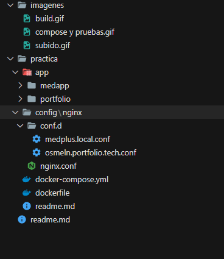
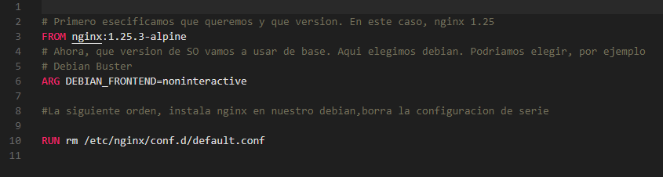
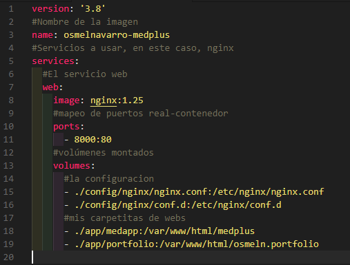
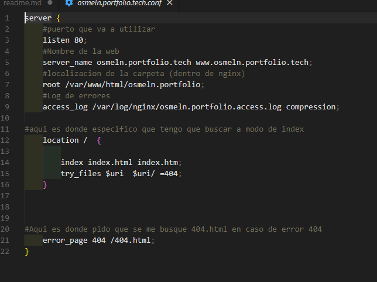
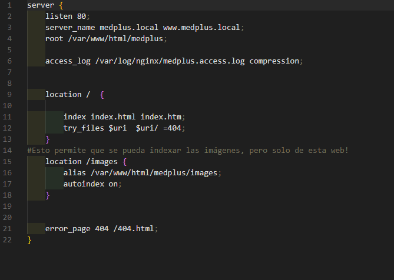
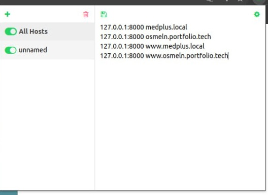
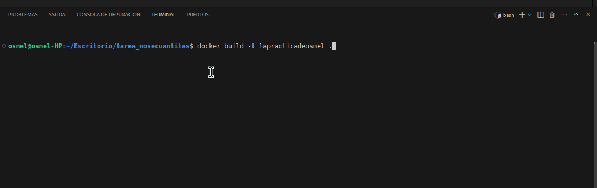
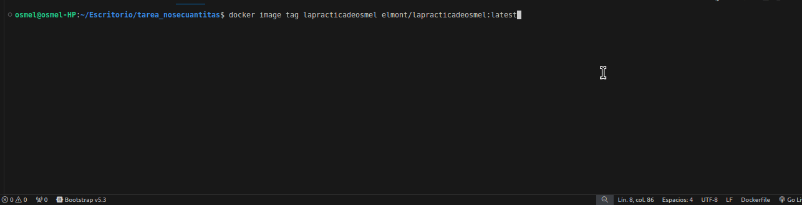

# UT6. Tarea Evaluable 6.2 - Crear imagen Docker para desplegar 2 aplicaciones estáticas
Osmel Navarro
--Descripción: Desplegar 2 aplicaciones en un mismo contenedor nginx y subirlas a Dockerhub
-
#### 1 Explicación del proceso

1.-Creamos la estructura de carpetas necesaria. En mi caso, la carpeta 'app' contiene dos carpetas, y cada una de ellas es una de las webs a desplegar. Incluyo además la carpeta de nginx (con su archivo de configuracion correspondiente) y dentro de nginx,la carpeta 'conf.d' con un conf correspondiente a cada web que quiero utilizar.

Fuera de esto, mis archivos docker compose y dockerfile 

2.- DockerFile y docker-compose

De nombre, le he puesto 'medplus'. De puerto real, debido a limitaciones de mi equipo, he optado por mapear mi puerto 8000 al 80 de la máquina, en lugar del 80 real

3.- Ahora, configuramos los archivos correspondientes a ambas páginas web. Ambas son prácticamente iguales, con la excepcion de que cada una (obviamente) apunta a su propio sitio web, y que una de ellas permite indizar las imágenes. A pesar de que ambas configuraciones son muy parecidas, cada una buscará su propio index y su propia página de error 404

#### 2 Construir y probar el contenedor
Una vez configurado, probamos que funmcione el contenedor, y mapeo el DNS a mis dominios.
Para mapearlos en chrome-chromium,. usamos esta extensión donde ponemos la direccion IP y luego el nombre correspondiente

#### 3 Subir a DockerHub
Ahora, construyo mi imagen

Y una vez lista, le pongo un tag y la subo a dockerhub

